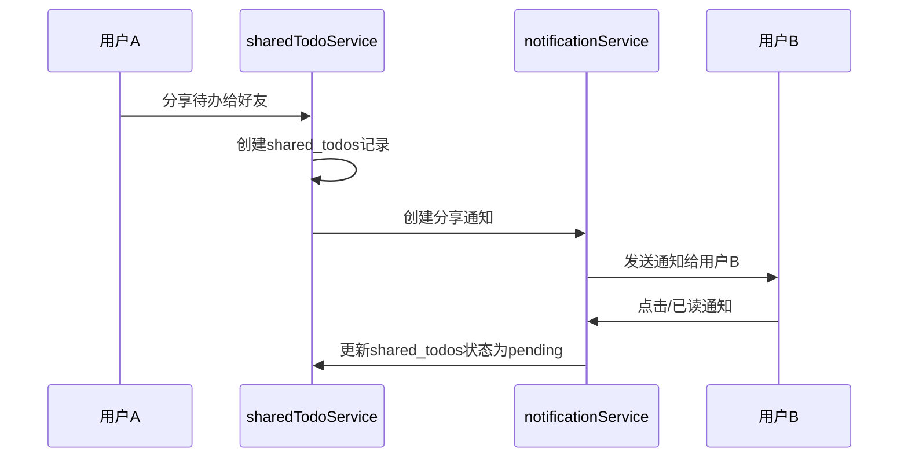
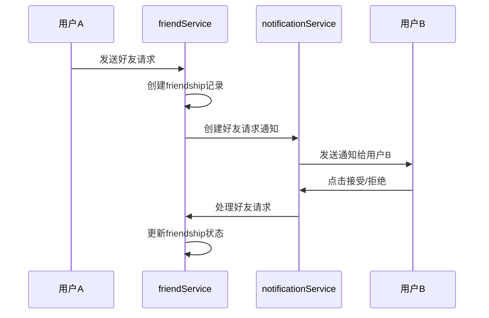

# 🔔 消息通知系统

## 📋 功能概述

实现了完整的消息通知系统，支持好友请求和分享待办的实时通知功能。

### 🎯 核心功能

1. **分享待办通知**
   - 用户A分享todo给用户B时，B收到分享通知
   - 当B已读通知时，自动将shared_todos表的status设为pending

2. **好友请求通知**
   - 用户A向用户B发送好友请求时，B收到好友请求通知
   - B可以直接在通知中点击接受/拒绝按钮

## 🏗️ 系统架构

### 数据库表结构

```
notifications 表：
- $id: 通知ID
- toUserId: 接收者ID
- fromUserId: 发送者ID
- type: 通知类型
- title: 通知标题
- message: 通知内容
- data: JSON数据（包含额外信息）
- status: 通知状态 (unread/read/archived)
- actionUrl: 点击跳转链接
- $createdAt: 创建时间
- $updatedAt: 更新时间
```

### 通知类型枚举

```javascript
export const NOTIFICATION_TYPE = {
  FRIEND_REQUEST: 'friend_request',     // 好友请求
  FRIEND_ACCEPTED: 'friend_accepted',   // 好友请求被接受
  FRIEND_REJECTED: 'friend_rejected',   // 好友请求被拒绝
  TODO_SHARED: 'todo_shared',           // 待办事项被分享
  TODO_REMINDER: 'todo_reminder',       // 待办事项提醒
  SYSTEM: 'system'                      // 系统通知
};
```

## 🔄 业务流程

### 分享待办流程



### 好友请求流程



## 🛠️ 核心服务实现

### 1. notificationService.js

```javascript
// 创建分享待办通知
async createTodoSharedNotification(fromUserId, toUserId, fromUserName, todoTitle, todoId) {
  return await this.createNotification({
    toUserId,
    fromUserId,
    type: NOTIFICATION_TYPE.TODO_SHARED,
    title: '收到分享的待办',
    message: `${fromUserName} 分享了待办"${todoTitle}"给您`,
    data: { fromUserId, fromUserName, todoId, todoTitle },
    actionUrl: '/dashboard'
  });
}

// 创建好友请求通知
async createFriendRequestNotification(fromUserId, toUserId, fromUserName, friendshipId) {
  return await this.createNotification({
    toUserId,
    fromUserId,
    type: NOTIFICATION_TYPE.FRIEND_REQUEST,
    title: '新的好友请求',
    message: `${fromUserName} 想要添加您为好友`,
    data: { fromUserId, fromUserName, friendshipId },
    actionUrl: '/dashboard/friends'
  });
}

// 标记为已读时的自动处理
async markAsRead(notificationId, userId) {
  // 标记通知为已读
  const result = await updateNotificationStatus(notificationId, 'read');
  
  // 如果是分享通知，自动更新shared_todos状态
  if (notification.type === NOTIFICATION_TYPE.TODO_SHARED) {
    const shareRecord = await findSharedTodoRecord(notification.data.todoId, userId);
    if (shareRecord && shareRecord.status === 'unread') {
      await sharedTodoService.updateShareStatus(shareRecord.$id, 'pending', userId);
    }
  }
  
  return result;
}
```

### 2. sharedTodoService.js

```javascript
async shareTodoWithFriends(todoId, friendIds, fromUserId) {
  // 获取待办和分享者信息
  const todo = await todoService.getTodoById(todoId, fromUserId);
  const sharer = await userService.getUserById(fromUserId);
  
  for (const friendId of friendIds) {
    // 创建分享记录
    const shareData = {
      todoId,
      userId: friendId,
      fromUserId,
      status: SHARED_TODO_STATUS.UNREAD
    };
    await createShareRecord(shareData);
    
    // 创建通知
    await notificationService.createTodoSharedNotification(
      fromUserId,
      friendId,
      sharer.name,
      todo.title,
      todoId
    );
  }
}
```

### 3. friendService.js

```javascript
async sendFriendRequest(fromUserId, toUserId) {
  // 发送好友请求
  const friendshipResult = await friendshipService.sendFriendRequest(fromUserId, toUserId);
  
  // 获取发送者信息
  const fromUser = await userService.getUserById(fromUserId);
  
  // 创建通知
  await notificationService.createFriendRequestNotification(
    fromUserId,
    toUserId,
    fromUser.name || fromUser.email,
    friendshipResult.$id
  );
  
  return friendshipResult;
}

// 处理好友请求接受
async handleFriendRequestAccept(notificationId, friendshipId, userId) {
  // 接受好友请求
  const updatedFriendship = await this.acceptFriendRequest(friendshipId, userId);
  
  // 标记通知为已读
  await notificationService.markAsRead(notificationId, userId);
  
  return updatedFriendship;
}
```

## 🎨 UI组件

### NotificationList.js

**功能特性：**
- 显示真实的通知数据
- 支持分页和过滤
- 操作按钮（接受/拒绝好友请求）
- 自动标记已读
- 删除通知功能

**关键实现：**
```javascript
// 渲染操作按钮
const renderActionButtons = (notification) => {
  if (notification.type === NOTIFICATION_TYPE.FRIEND_REQUEST && 
      notification.status === NOTIFICATION_STATUS.UNREAD) {
    return (
      <div className="flex space-x-2 mt-3">
        <button onClick={() => handleAcceptFriendRequest(notification)}>
          接受
        </button>
        <button onClick={() => handleRejectFriendRequest(notification)}>
          拒绝
        </button>
      </div>
    );
  }
  return null;
};
```

### 页面结构

```
/notifications/real/page.js - 真实通知页面
├── 顶部导航（返回、标题、全部已读、刷新）
├── 过滤器（全部、好友请求、分享待办、系统通知）
└── NotificationList组件
```

## 📱 用户交互流程

### 分享待办通知

1. **发送过程：**
   ```
   用户A在待办详情页 → 点击分享按钮 → 选择好友 → 确认分享
   → 系统创建分享记录 → 发送通知给好友 → 显示成功提示
   ```

2. **接收过程：**
   ```
   用户B收到通知 → 在通知列表看到分享通知 → 点击查看详情
   → 自动标记已读 → shared_todos状态变为pending
   ```

### 好友请求通知

1. **发送过程：**
   ```
   用户A搜索用户 → 点击发送好友请求 → 系统创建friendship记录
   → 发送通知给目标用户 → 显示请求已发送
   ```

2. **处理过程：**
   ```
   用户B收到通知 → 看到好友请求通知 → 点击接受/拒绝按钮
   → 系统更新friendship状态 → 标记通知已读 → 发送确认通知给A
   ```

## 🔧 状态管理

### shared_todos状态流转

```
unread → pending → complete
  ↑        ↑         ↑
创建分享  已读通知   完成任务
```

### friendship状态流转

```
pending → accepted/rejected
   ↑           ↑
发送请求    处理请求
```

### notification状态流转

```
unread → read → archived
  ↑       ↑        ↑
创建通知  点击查看  用户删除
```

## 🚀 优化特性

1. **性能优化**
   - 通知列表支持分页加载
   - 批量标记已读操作
   - 自动清理旧通知

2. **用户体验**
   - 实时未读数量显示
   - 流畅的动画效果
   - 下拉刷新功能

3. **错误处理**
   - 网络失败重试机制
   - 操作失败提示
   - 数据一致性保证

## 📊 监控指标

- 通知发送成功率
- 通知阅读率
- 好友请求接受率
- 分享待办参与率

## 🎯 使用说明

### 访问真实通知页面

```bash
# 访问路径
/notifications/real

# 或者在代码中跳转
router.push('/notifications/real');
```

### 集成到现有系统

```javascript
// 在需要的地方导入NotificationList组件
import NotificationList from '../components/NotificationList';

// 使用组件
<NotificationList
  selectedType="all"
  onNotificationUpdate={handleUpdate}
  className="custom-style"
/>
```

---

**✅ 实现结果**: 完整的消息通知系统已上线，支持分享待办和好友请求的实时通知功能，提供流畅的用户交互体验。 